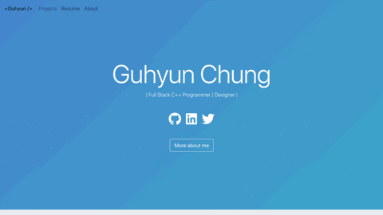
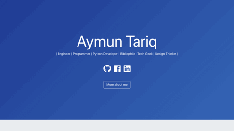

<table>
  <tr>
    <td align="center">
      <a href="https://github.com/justiceserv/justiceserv.github.io">
        
         
        <b>Guhyun Chung</b>
      </a>
       
    </td>
    <td align="center">
      <a href="https://github.com/hamzasohail0/home/">
        
         
        <b>Hamza Sohail</b>
      </a>
       
    </td>
    <td align="center">
      <a href="https://github.com/AymunTariq/home/">
        
         
        <b>Aymun Tariq</b>
      </a>
       
    </td>
  </tr>
  <tr>
    <td align="center">
      <a href="https://github.com/anaashrafi/home/">
        
         
        <b>Ana Ashrafi</b>
      </a>
       
    </td>
    <td align="center">
      <a href="https://github.com/jefferyjohn/home/">
        
         
        <b>Jeffery John</b>
      </a>
       
    </td>
    <td align="center">
      <a href="https://github.com/remimestdagh/home/">
        
         
        <b>Remi Mestdagh</b>
      </a>
       
    </td>
  </tr>
    <tr>
    <td align="center">
      <a href="https://github.com/xunxdd/portfolio/tree/master">
         
        <b>Xun Ding</b>
      </a>
       
    </td>    
    <td align="center">
      <a href="https://github.com/S-Philp/Shannel.philp">
         
        <b>Shannel Philp</b>
      </a>
       
    </td>    
    <td align="center">
      <a href="https://github.com/bibinvargheset/home">
         
        <b>Bibin Varghese</b>
      </a>
       
    </td>
  </tr>
</table>

## Versão em Português :brazil:

Esse projeto foi traduzido para português! Se você gostou dele e quer criar a sua própria versão, confira o repositório do [@tashima42](https://github.com/tashima42) em [https://github.com/Tashima42/home](https://github.com/Tashima42/home).
Novas contribuições e revisões na tradução são muito bem vindas!

## Notice:

This project has been archived. Means that it is no longer actively maintained by developer. Free free to fork, use and maintain your own version. You can check my new portfolio template [here](https://github.com/hashirshoaeb/portfolio)

## Stargazers over time

](https://github.com/akash25bala)https://github.com/akash25bala
](https://github.com/akash25bala)https://github.com/akash25bala
